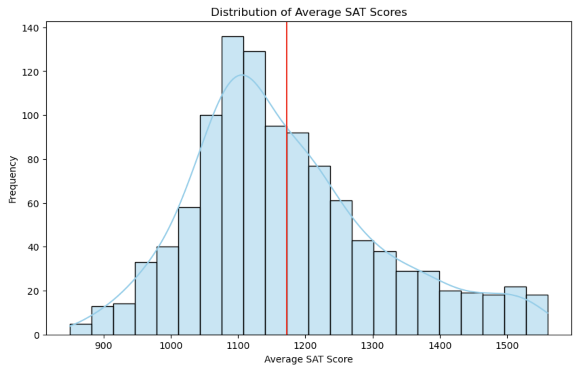
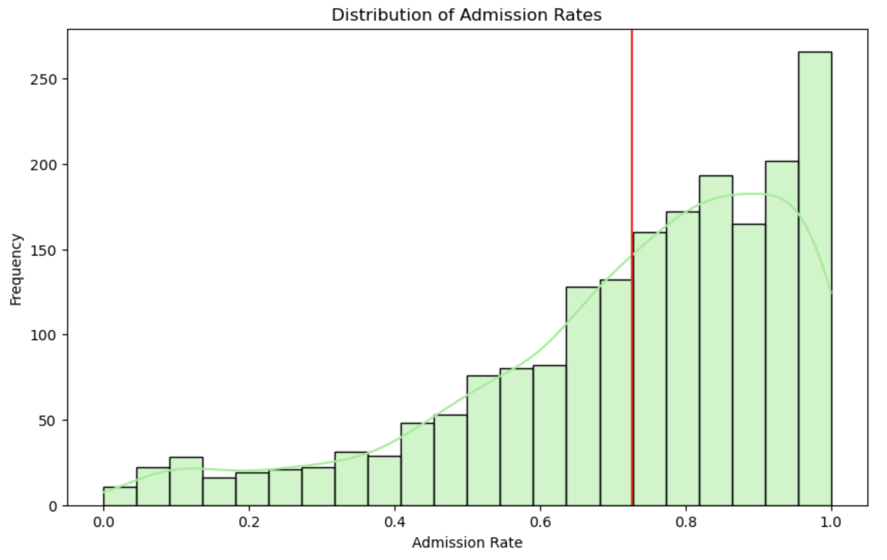
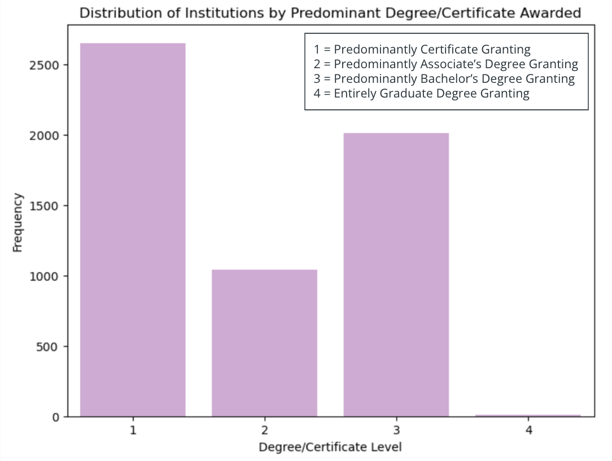
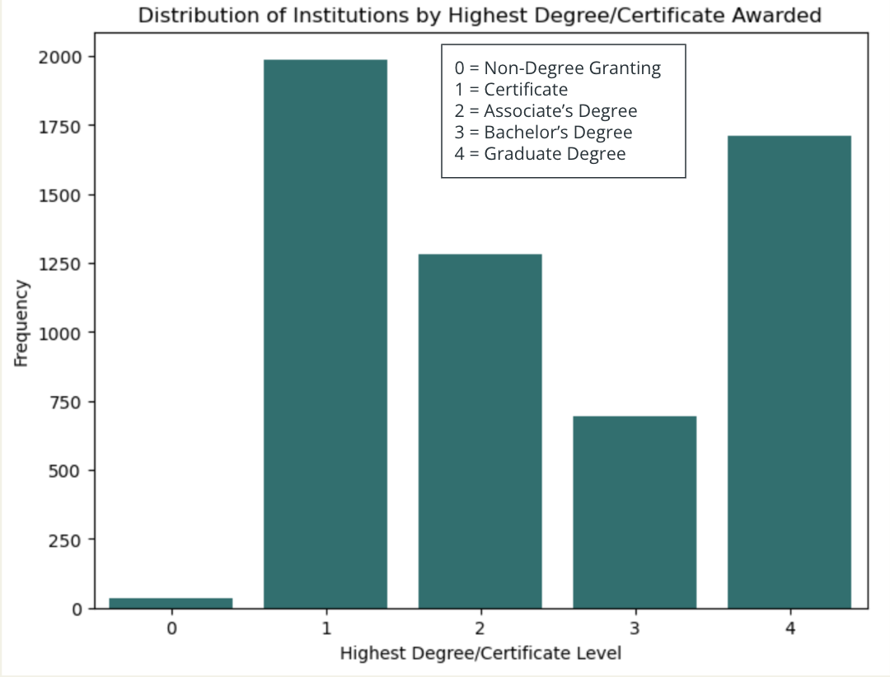
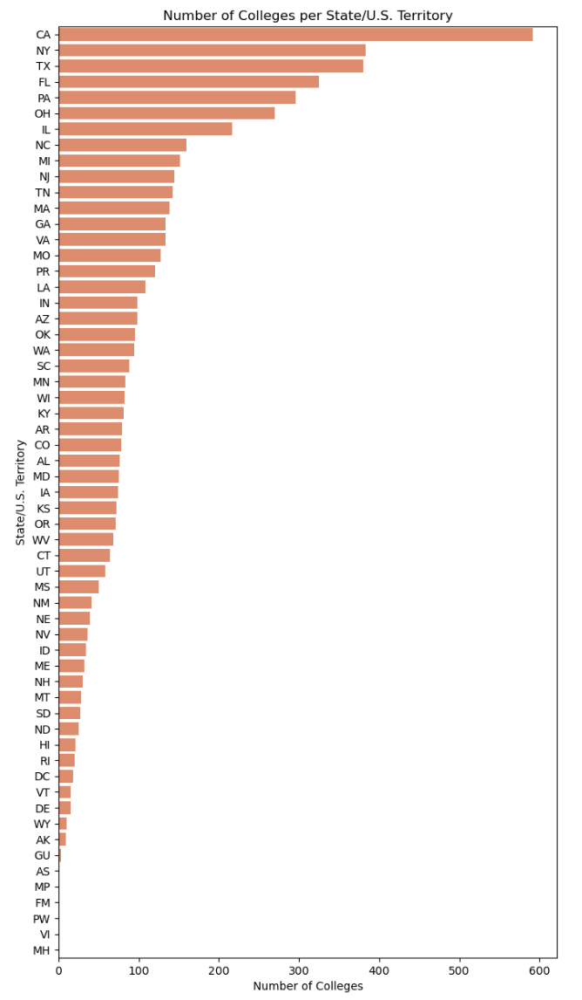
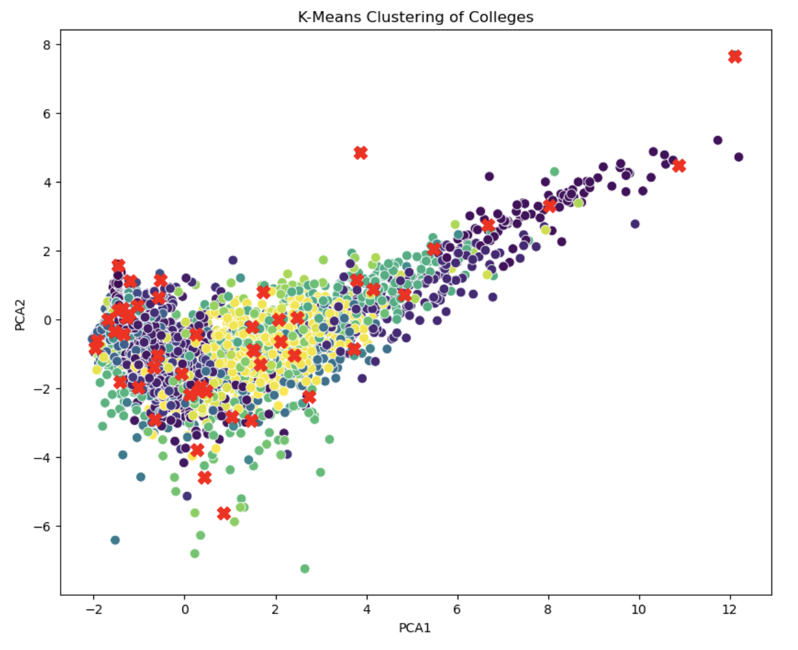
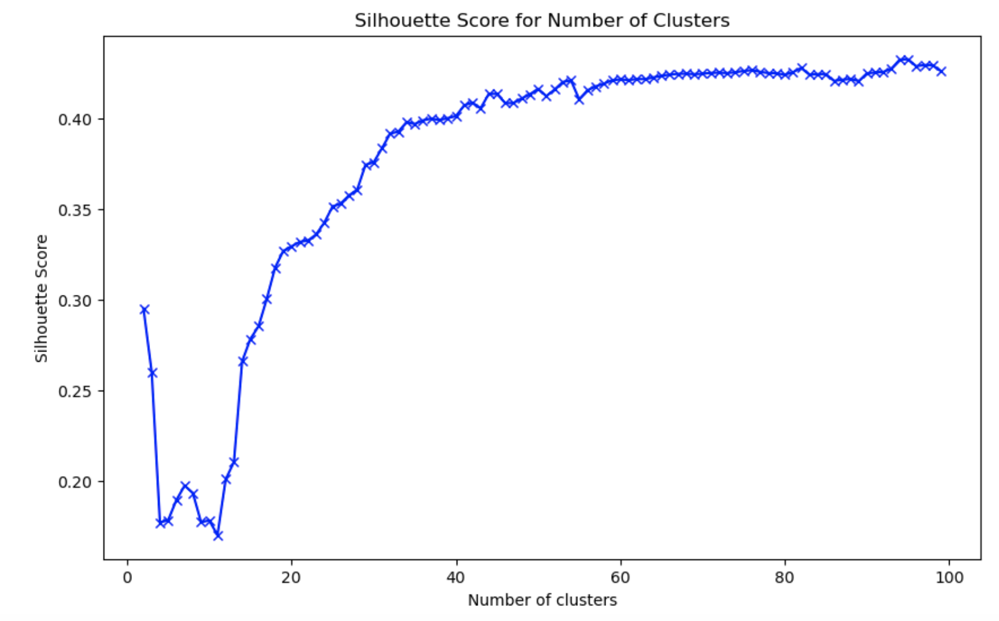
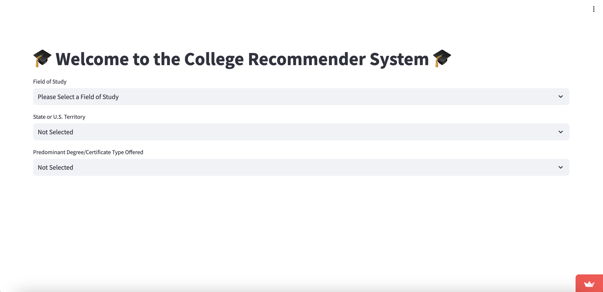

# Capstone Project: College Recommender System

# Problem Statement
High school can be a challenging time for both students and their parents. On top of balancing grades, standardized testing, and extracurricular activities, choosing which colleges to apply to can be another stressful task that high school students have to take on. To help take the stress off of picking colleges, a recommender system would be a very helpful tool for students and their parents. A college recommender system could filter the right colleges based on field of study, location preferences, and degree types that they are searching for.

# Executive Summary
This project utilizes KMeans and DBSCAN clustering models to categorize academic institutions together based on the percent of degrees or certificates awarded in a particular field of study. To do this, data was collected on colleges from the U.S. Department of Education’s College Scorecard data files. The data was cleaned and specific features were selected. Summary statistics were calculated, exploratory data analysis was conducted, and initial findings were visualized. Models were then utilized to cluster the data, and those models were evaluated. Lastly, the college recommender system for students and parents was developed.

# Table of Contents:
- [Project Title](#Capstone-Project:-College-Recommender-System)
- [Problem Statement](#Problem-Statement)
- [Executive Summary](#Executive-Summary)
- [Data Dictionary](#Data-Dictionary)
- [Visualizations](#Visualizations)
- [Modeling and Evaluation](#Modeling-and-Evaluation)
- [Conclusions and Recommendations](#Conclusions-and-Recommendations)
- [Limitations and Future Studies](#Limitations-and-Future-Studies)
- [Sources](#Sources)

# Data Dictionary

The data used in this project comes from the U.S. Department of Education’s College Scorecard data files.
For more details, please see the data.yaml file.

|Feature|Type|Dataset|Description|
|---|---|---|---|
|INSTNM|object|data_cleaned.csv|Institution name|
|CITY|object|data_cleaned.csv|Institution city|
|STABBR|object|data_cleaned.csv|State abbreviation|
|INSTURL|object|data_cleaned.csv|Institution URL|
|PREDDEG|int|data_cleaned.csv|Predominant undergraduate degree awarded|
|HIGHDEG|int|data_cleaned.csv|Highest degree awarded|
|ADM_RATE|object|data_cleaned.csv|Admission rate|
|SAT_AVG|object|data_cleaned.csv|Average SAT equivalent score of students admitted|
|CURROPER|int|data_cleaned.csv|Currently operating institution, 0=closed, 1=operating|
|ADDR|object|data_cleaned.csv|Institution address|
|PCIPXX|float|data_cleaned.csv|Percentage of degrees awarded in a particular field of study|

**Datasets**
- MERGED2022_23_PP.csv: Dataset from College Scorecard from 2022-2023 academic year.
- data_cleaned.csv: Dataset from College Scorecard from 2022-2023 academic year cleaned and features selected.

# Visualizations

# Modeling and Evaluation
- Clustering was done using KMeans and DBSCAN
- KMeans Silhouette Score: 0.41526884799239544
- DBSCAN Silhouette Score: 0.4057589009879435

# Conclusions and Recommendations
- Clustering worked well for some fields of study, but not all
- Silhouette Score is not very good even after using two methods of clustering
- College Recommender System was created for clustering and value sorting
- Recommend using value sorting for fields of study as clustering is not always the most accurate with this particular dataset

# Limitations and Future Studies
- Data was only taken from the 2022-2023 academic year
- Other datasets from the past decade or so should be used
- Specific features, namely the percentage of degrees awarded in a particular field of study, were selected for clustering
- Other features in dataset could be used to improve clustering and silhouette score
- Current college recommender system primarily filters based on field of study, location, and predominant degree type offered
- College recommender system can be augmented by additional filtering options such as cost, type of institution, or graduation rate

# Sources
- U.S. Department of Education:
    - College Scorecard data files: https://collegescorecard.ed.gov/data
- Data Dictionary:
    - data.yaml
- Datasets:
    - MERGED2022_23_PP.csv
    - data_cleaned.csv
- Streamlit.io